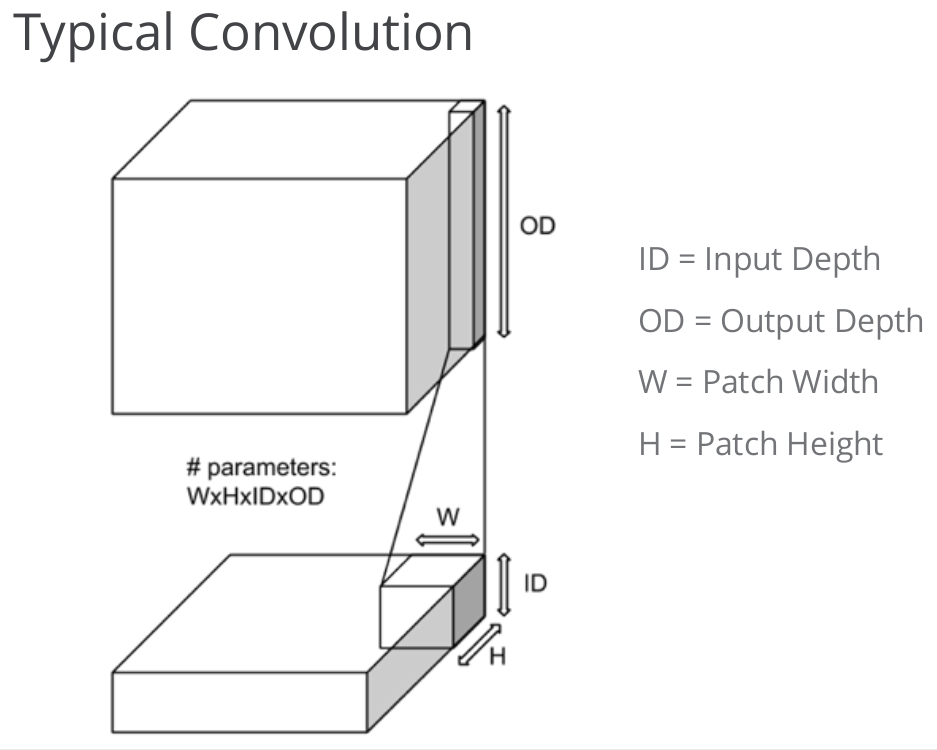
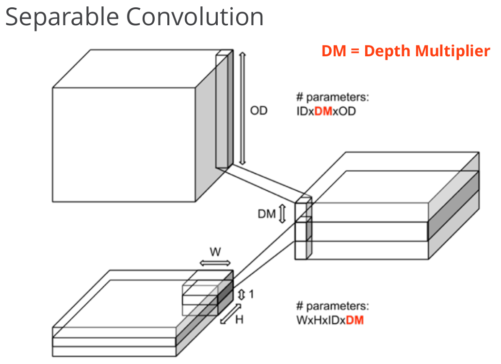
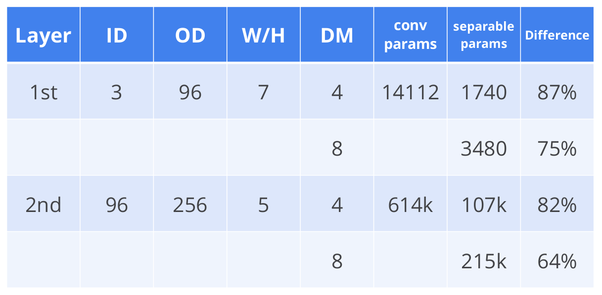
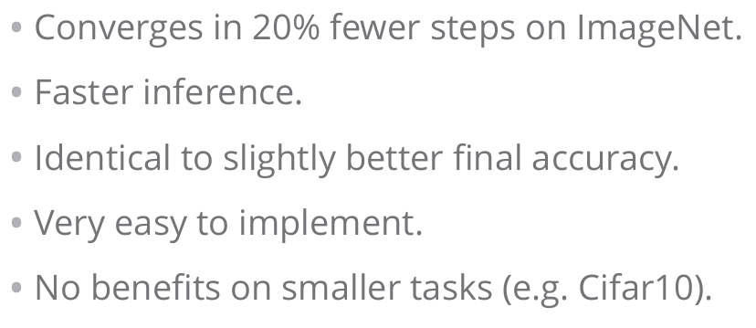
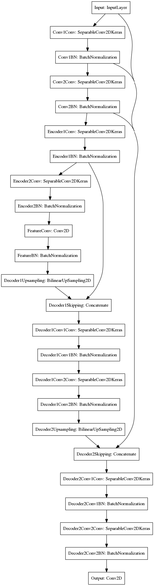

## README

### Technical Report for Fully-Convolutional Network based Follow Me

---


The goals of this project are the following:
* Use the simulator to collect data of to-be-tracked person
* Build, a fully-convolutional network in Keras that segments the to-be-tracked person
* Train and validate the model with a training and validation set
* Test that the model successfully tracks the target person

---

### Files Submitted

---

#### Submission includes all required files and can be used to run the simulator in autonomous mode

My project includes the following files:
* **code/model_training.ipynb**: Jupyter notebook used to train the FCN.
* **docs/report/model_training.html**: HTML version of the Jupyter notebook.
* **README.md**: writeup report for technical review
* **data/weights/config_model_weights & data/weights/model_weights**: deployed FCN model for simulator control

After downloading the deployed model, it can be used to control the quad-rotor through the following commands:

```shell
python follower.py model_weights
```

---

### Model Architecture and Training Strategy

---

#### 1. Convolutional layers used

In this project two special convolution layers are used.

The first one is **separable convolution layers** used in GoogLe Inception Net.






In this type of layer, 1×1 convolution intermediate layer, the so-called network in network, is used to reduce computation workload
while maintains global network performance. This is very useful for intermediate layer with significant input depth.

The second one is **deconvolution/transposed convolution layers** described in the reference paper.


This type of layer helps to propagate high-level features down to low-levels.
In this project upsampling through bilinear transform, together with padding is used to dilate smaller size input for larget size output.

#### 2. Network architecture



The visualization of the built Keras model is shown in the figure above.  Below is a table for architecture summarization.

|        Layer       |                                   Description                                   |
|:------------------:|:-------------------------------------------------------------------------------:|
|        Input       |                               Dimension: 160×160×3                              |
|    Convolution1    |                 Kernel: 3×3×16, Stride: 1×1, Batch Normalization                |
|    Convolution2    |                 Kernel: 3×3×16, Stride: 1×1, Batch Normalization                |
|      Encoder1      |                 Kernel: 3×3×32, Stride: 2×2, Batch Normalization                |
|      Encoder2      |                 Kernel: 3×3×64, Stride: 2×2, Batch Normalization                |
|   1×1 Convolution  |                 Kernel: 1×1×64, Stride: 1×1, Batch Normalization                |
|      Decoder1      |              Kernel: 3×3×64, Stride: 1×1, Skip Connection: Encoder1             |
|      Decoder2      | Kernel: 3×3×32, Stride: 1×1, Skip Connection: Convolution2, Convolution1, Input |
| Output Convolution |        Kernel: 3×3×3, Stride: 1×1, Softmax activation along depth channel       |

The architecture is developed following the design philosophy of <a href="reference/fully-convolutional-network.pdf">Fully Convolutional Networks for Semantic Segmentation</a>

1. First, two fine-grained convolution layers, *Convolution1* & *Convolution2*, are used to extract spatial features around a given pixel.
2. After that, two encoder blocks, *Encoder1* & *Encoder2*, are added to learn high-level features for classification.
3. For the bottleneck connection, one 1×1 convolution layer, *1×1 Convolution* is used to summarize spatial features.
4. Following the bottleneck, two decoder blocks, *Decoder1* & *Decoder2*, are used to propagate high-level features down to pixel level.
5. Finally, one convolution layer with depthwise softmax activation, *Output Convolution* is used to produce the output.

Here are the implementations of encoder & decoder blocks:

```python
def encoder_block(input_layer, filters, kernel_size, strides):
    """ Create an encoder block using:
            separable convolution with batch normalization
    """
    output_layer = separable_conv2d_batchnorm(
        input_layer,
        filters,
        kernel_size,
        strides
    )

    return output_layer

def decoder_block(input_layer, skip_layers, filters):
    """ Create a decoder block using:
            a. bilinear upsampling
            b. skip connection
            c. separable conv2d
    """
    # Upsample the small input layer using the bilinear_upsample() function.
    upsampled_layer = bilinear_upsample(input_layer)

    # Concatenate the upsampled and large input layers using layers.concatenate
    concatenated_layer = layers.concatenate(
        [upsampled_layer] + skip_layers
    )

    # Add some number of separable convolution layers
    preoutput_layer = separable_conv2d_batchnorm(
        concatenated_layer,
        filters
    )
    output_layer = separable_conv2d_batchnorm(
        preoutput_layer,
        filters
    )

    return output_layer
```

The signature of decoder_block is slightly modified to enable stacked skip connection presented in the original paper.

Besides, **learning rate scheduling, model checkpoint & early stopping** are also implemented through use of Keras callbacks.

```python
# Monitors:
callbacks = [
    # Learning rate reducer:
    callbacks.ReduceLROnPlateau(
        monitor='val_loss',
        factor=5e-1,
        patience=2,
        verbose=1,
        mode='auto',
        epsilon=0.0002,
        cooldown=0,
        min_lr=1e-7
    ),
    # Early stopping:
    callbacks.EarlyStopping(
        monitor='val_loss',
        min_delta=0.0002,
        # four time larger than that of learning rate reducer:
        patience=6,
        verbose=1,
        mode='auto'
    ),
    # Checkpoints:
    callbacks.ModelCheckpoint(
        filepath="weights.{epoch:02d}-{val_loss:.4f}.hdf5",
        monitor='val_loss',
        verbose=1,
        save_best_only=True, save_weights_only=False,
        mode='auto',
        period=1
    ),
    # Logger & Plotter:
    plotting_tools.LoggerPlotter()
]
```

#### 2. Hyperparameter tuning

Here are my choices and reasons for model hyperparameters.

|               Param              |  Value |                                           Explanation                                          |
|:--------------------------------:|:------:|:----------------------------------------------------------------------------------------------:|
|            Batch Size            |   64   | Maximum allowed size given current model architecture(single machine GTX1060 with 5.93GB memo) |
|          Steps Per Epoch         |   96   |       Training set contains 5543 original images with flip augmentation during iteration.      |
|           Num. Epoches           |   64   |                 Since early stopping is used, this just needs to be long enough                |
|          Validation Step         |   16   |                   6 times per epoch for smooth estimation of validation error                  |
|             Optimizer            | NAdams |  Due to the limited batch size, momentum mechanism is included to stabilize training progress  |
|       Initial Learning Rate      |  2e-3  |                                Recommended value by Adams paper                                |
| Learning Rate Scheduler Patience |    2   |                                          Trial & error                                         |
|      Early Stopping Patience     |    6   |                                          Trial & error                                         |


#### 3. Comparison between 1×1 convolutional & fully-connected layers

For image processing tasks, the difference between fully-connected & 1×1 convolutional layers are as follows.

1. Fully-connected layers are good for image classification tasks as last to output layers. For classification only image-wise summary statistics matter. So local spatial information can be safely aggregated through fully-connected layers to derive the final image-wise features for classification.
2. 1×1 convolutional layers are suitable for local non-linear transformation as intermediate CNN layers. 1×1 convolution is good if you want to add further non-linearity to your model at the minimum cost of extra parameter size, as the case of Google Inception Net. For pixel-wise classification, 1×1 convolution should also be used to extract higher-level feature while still keep the local spatial information. After 1×1 convolution, higher-level features can be correctly propagated down to each pixel so as to finally be used as pixel-wise feature for pixel classification.

#### 4. Data manipulation

In this project, following image manipulations are used:

1. The raw sim. image is converted to jpeg to reduce its storage size.
2. Inside batch iterator, each image is standardized to have zero mean so as to facilitate training process.
```python
def preprocess_input(x):
    x = x/255.
    x = x-0.5
    x = x*2.
    return x
```
3. Left-right flip is also added by myself to enlarge training & validation sets.
```python
def flip_augmentation(image, image_mask):
    new_im = np.fliplr(image)
    new_mask = np.fliplr(image_mask)

    return new_im, new_mask
```

Besides, I also think this dataset should be rebalanced since the class distribution is extremely skewed.

1. One simple way is to add sample weights to each pixel.
2. Another is to collect more data containing the target hero.

For this project I used method 2. About 1400 images are added to training set and 400 images are added to validation set.

This ~1800 images helped to boost the final score from 0.35 to 0.41.

#### 5. Generalization of current network

**The network cannot be used to track either other objects like dog, cat, car or other specific person.** The reasons are as follows:

* The network is trained in a supervised way. However, only 3 types of labeled data, namely target person, other person and background, are provided.

Since no data is provided for definition of other objects, the network cannot be used to track them.

**In order to use the network for tracking of other objects**, following modifications can be applied to the training procedure

1. Collect images containing target objects with pixelwise labeling.
2. If the collected dataset is large enough, train a network from scratch.
3. If the collected dataset is only of limited size, transfer a pre-trained network attained on a huge & diverse dataset like VGG16 and fine-tune it on collected data, as it did in the original FCN paper.

---

### Model Performance

---

#### The neural network should obtain an accuracy greater than or equal to 40% (0.40) using the Intersection over Union (IoU) metric

According to the Jupyter notebook attained after an arduous training, the metrics and corresponding values are as follows:

|    Metric   |  Value |
|:-----------:|:------:|
|   Accuracy  | 0.7588 |
|     IOU     | 0.5452 |
| Final Score | 0.4137 |

They meet the performance requirement.

---

### Future Enhancements

---

From the iterative training process, imbalanced class distribution appears to be the main obstacle that hinders performance improvement.

For future iterations, I think following improvements could be made upon current framework:

1. More scene images containing target hero, especially those from far away view points, could be added to further boost hero detection performance.
2. Pixel-wise weight could be used to further reduce the effects of skewed class distribution. This needs further hacking since currently Keras only supports image-wise weight not pixel-wise weight.
